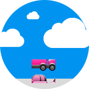

<p align="center">
    
</p>

<h1 align="center">OpenRide</h1>
<p align="center">🎒 Offri o cerca un passaggio per andare a scuola 🏫</p>

> Software realizzato per la partecipazione alla [CodeWeek 2021](http://www.codeweek.it/open-ride/), 
la serie di eventi che ogni anno si pone l’obiettivo di diffondere la cultura del coding e della 
programmazione fin dalla tenera età.  
> L’iniziativa, promossa direttamente dalla Commissione Europea, ci ha visto protagonisti il 22 ottobre: 
le scuole secondarie, medie o superiori hanno potuto partecipare allo streaming direttamente dalle 
proprie aule.  
> Al seguente link è possibile rivedere la registrazione dell’evento:
https://www.youtube.com/watch?v=CbNhhdJe8DM

### Experimenting and Contributing

Se hai voglia di sperimentare e/o contribuire a questa app segui i seguenti passi per farla 
funzionare sul tuo computer.

N.B. Tutti i successivi comandi devono essere eseguiti all’interno del proprio terminale.

### Requirements

#### Node

Per far funzionare la webapp sul tuo computer è necessario aver installato l’environment di esecuzione: [Node.js](https://nodejs.org/it/)!

Consigliamo l’utilizzo del tool [Volta](https://volta.sh/) che faciliterà questo processo.

##### MacOS/Unix

> *NB*: Se utilizzi il terminale nativo `cmd.exe` o `Powershell` [segui qui](#windows)
> Se invece stai utilizzando il subsystem Ubuntu su Windows segui i passi di seguito

Installiamo Volta

```bash
curl https://get.volta.sh | bash
# oppure se non hai installato curl, puoi usare wget!
wget -qO- https://get.volta.sh | bash
```

Installiamo la versione di Node.js necessaria

> *NB* Questo installerà anche il package manager [NPM](https://www.npmjs.com/)

```bash
volta install node@14.17.6
```

##### Windows

Prima di poter installare Volta sul terminale Windows (cmd.exe) è necessario prima:

- Scaricare l’installer di [Volta per Windows](https://github.com/volta-cli/volta/releases/download/v1.0.5/volta-1.0.5-windows-x86_64.msi)
- Cliccare sull’installer e seguire le istruzioni
- Abilitare la [modalità sviluppatori](https://docs.microsoft.com/it-it/windows/apps/get-started/enable-your-device-for-development#accessing-settings-for-developers)
- Apriamo `cmd.exe` e installiamo Node.js:
```bash
volta install node@14.17.6
```

#### Git

Per poter portare sulla propria macchina il software consigliamo anche l’installazione di [Git](https://git-scm.com/). 
La procedura potrebbe variare in base al vostro sistema operativo, quindi vi rimandiamo alla 
[documentazione ufficiale](https://github.com/git-guides/install-git#:~:text=To%20install%20Git%2C%20run%20the,installation%20by%20typing%3A%20git%20version%20.).

### Install App

Ora siamo pronti per poter installare l’app.  

Scarichiamo i sorgenti:
```bash
git clone git@github.com:immobiliare/open-ride.git
```

Entriamo dentro alla directory appena creata:
```bash
cd open-ride
```

Installiamo le dipendenze della nostra app definite all’interno del [package.json](./package.json):
```bash
yarn intall
```

### Config

Per far funzionare la nostra app abbiamo bisogno di configurare alcune variabili d’ambiente.  
Copiamo il file di esempio e modifichiamo le variabili con i valori corretti:
```bash
cp .env .env.local
```
Ora abbiamo il nostro file di configurazione `.env.local` al quale dobbiamo modificare i `CHANGE_ME` con i valori corretti:
* `APP_SECRET`: impostate una parola segreta a vostra scelta
* `OPENROUTE_APIKEY`: Tramite registrazione sul portale di [OpenRouteService](https://openrouteservice.org) è possibile avere la propria `API_KEY` da dover impostare per questo valore
* `SCHOOL_COORDINATES`: impostate le coordinate (longitudine,latitudine) della vostra scuola

### Go!
Lanciare il seguente comando:
```bash
yarn dev
```
e dopo qualche secondo apri la seguente pagina [http://localhost:3000](http://localhost:3000) 
sul tuo browser. 

## Learn More

Se vuoi saperne di piú sugli strumenti OpenSource utilizzati, dai uno sguardo ai seguenti riferimenti:
* [MUI Material](https://mui.com/) - la libreria UI utilizzata per stilare i componenti React
* [React](https://it.reactjs.org/) - la libreria JavaScript per creare interfacce utente
* [Next.js Documentation](https://nextjs.org/docs) - la documentazione ufficiale su tutte le funzionalità di Next.js
* [Learn Next.js](https://nextjs.org/learn) - un tutorial interattivo molto utile su Next.js.

## TODO

Vuoi metterti in gioco? Ecco qui per te delle possibili migliorie da apportare all’app:
* aggiungere la visualizzazione del tempo e distanza del percorso
* aggiungere gestione per specificare andata e/o ritorno
* aggiungere gestione dei posti a disposizione di un driver
* inviare notifiche al passeggero e al driver in caso di richiesta e accettazione


## Support

Made with ❤️ by [ImmobiliareLabs](https://github.com/immobiliare)

If you have any questions on how to use OpenRide, bugs and enhancement please feel free 
to reach out by opening a [GitHub Issue](https://github.com/immobiliare/open-ride/issues).

## License

OpenRide is licensed under the MIT license.  
See the [LICENSE](./LICENSE) file for more information.
